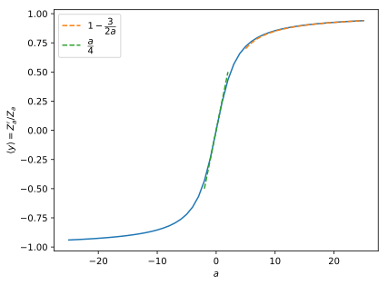

# Boltzmann on the disk

This convenience library approximates numerically the partition function of the Boltzmann distribution on a disk.

## Definition

Specifically, we define

$$
Z_a = \iint \exp( a y )  \mathrm{d} x  \mathrm{d} y
$$

where the integral is over the unit disk. In radial coordinates,

$$
Z_a
= \int_{r=0}^1 \int_{\theta =0}^{2\pi} \exp( a r \sin \theta )  r  \mathrm{d} r  \mathrm{d} \theta
= 2\pi \int_0^1 I_0(a r)  r  \mathrm{d} r
$$

after using one of [these](https://en.wikipedia.org/wiki/List_of_integrals_of_exponential_functions#Definite_integrals) relations.

To try it:
```python
from BoltzmannOnTheDisk import *

print(Z(3))
```

```console
>>>8.280011411531888
```

## Average position

The average position is

$$
\langle y \rangle
= \dfrac{1}{Z_a} \dfrac{\partial Z_a}{\partial a}
= -\dfrac{2}{a} + 2\pi \dfrac{I_0(a)}{aZ_a}
$$

This is how it looks:

```python
from pylab import *

a = linspace(-1,1,51)*25

plot( a, d_log_Z(a) )
```



## Assymptotic regimes

### High temperature

When $a$ is small, the exponential can be expanded (up to second order):

$$
Z_a
\approx \iint \left( 1 + a y + \dfrac{(ay)^2}{2} \right)  \mathrm{d} x  \mathrm{d} y
= \pi + \dfrac{\pi}{8} a^2
$$

and therefore

$$
\langle y \rangle \approx \dfrac{a}{4}
$$

### Low temperature

When $a$ is large, the only area that contributes to the partition function is the top of the disk ($y$ is almost one). Accordingly, we define

$$
y = 1 -\dfrac{\epsilon^2}{2}
$$

We then write

$$
Z_a
= 2 \int_{-1}^1 \exp( a y ) \sqrt{1-y^2}  \mathrm{d} y
\approx \exp( a ) \int_0^{\infty} \exp \left( -\dfrac{\alpha \epsilon^2}{2} \right)  \epsilon^2   \mathrm{d} \epsilon
= \sqrt{\dfrac{\pi}{2}} \exp(a) a^{-3/2}
$$

from which we get

$$
\langle y \rangle = \dfrac{\partial}{\partial a} \log Z_a
\approx 1 - \dfrac{3}{2a}
$$
